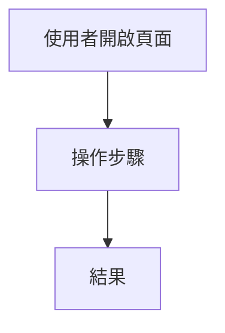
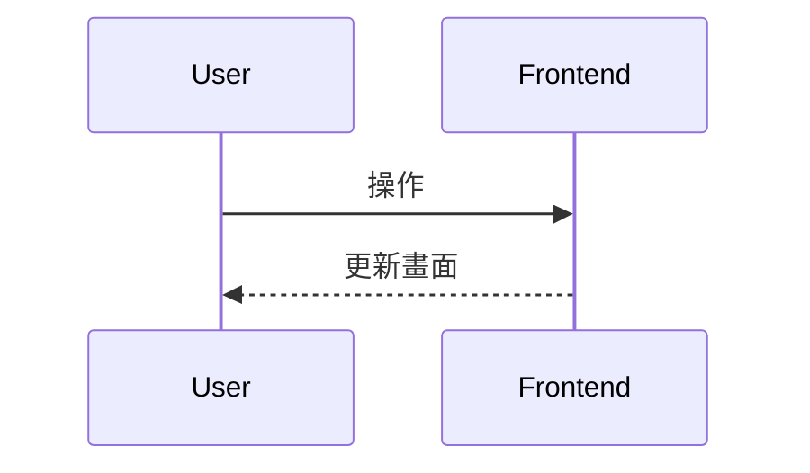
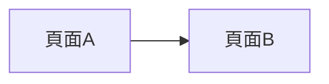

# {功能名稱} Mockup PRD（給後端 API 規格產生器使用）

> 此範本專門給 30%-feature-gen 產出的 **mockup PRD** 使用。  
> backend-api-spec-generator 會讀取這份文件與 Storybook mockups 來產生後端 API 規格。

---

## 1. 文件資訊

- **文件類型**：Mockup 需求規格書（前後端共用視圖）
- **適用對象**：前端開發、後端開發、產品、QA
- **最後更新**：{yyyy/mm/dd}
- **版本**：1.0.0
- **對應 Storybook**：`storybook/src/stories/mockups/{category}/{FeatureName}.stories.ts`
- **Storybook 連結**：<https://storybook.wport.me/?path=/docs/{story-id}--docs>（請將 `{story-id}` 替換為實際 Story ID，例如 `mockups-campus-event-campus-event-quick-apply-demo`；產出後請將此連結同時附在 PRD 與對應 Trello 卡片上）
- **建立日期**：{yyyy/mm/dd}

---

## 2. 開發進度與設計來源

### 開發進度

- **前端 PR #**：[TBD / 待開發後補上]
- **後端 PR #**：[TBD / 待開發後補上]

### 設計來源

- **Figma 連結**：[待補上]
- **Pixsole / 既有畫面**：（若有參照請註明）

---

## 3. 模擬頁面摘要（Mockup Summary）

### 3.1 功能概述

- **功能名稱**：{功能名稱}
- **主要使用者角色**：{Job Seeker / Employer / Admin / 等}
- **核心目標**：
  - {這個功能要解決的問題}

### 3.2 範圍界定

- **包含範圍**：
  - {頁面 / 區塊 / 行為 1}
  - {頁面 / 區塊 / 行為 2}
- **排除範圍**：
  - {明確不做的部分}

### 3.3 成功條件

- {成功條件 1}
- {成功條件 2}

---

## 4. 商業規則對齊（Business Rules Alignment）

> 供 backend-api-spec-generator 對齊 `prd/business-rules.md`。  
> 新功能若有新規則，先在此描述，再視情況回寫至 business-rules。

### 4.1 本功能使用到的業務規則

| 規則 ID | 規則摘要 | 是否關鍵 | 備註 |
|--------|----------|----------|------|
| BR-00X | {例：只有 email 已驗證的成員可執行 XXX} | ✅ 是 | 見 business-rules.md |
| BR-00Y | {例：公司未驗證時職缺不可上架} | ✅ 是 | |

### 4.2 補充說明（可選）

- {與既有行為差異、風險等}

---

## 5. 資料實體與欄位（Data Entities & Fields）

> backend-api-spec-generator 會依此節與 Storybook 的 interface/mock data 推導 API 結構。  
> 欄位命名請與 Storybook/TS 介面一致。

### 5.1 實體列表

| 實體名稱 | 說明 | 來源頁面/區塊 |
|----------|------|----------------|
| {EntityA} | {用途說明} | {例：成員選擇下拉、主列表} |
| {EntityB} | {用途說明} | {例：詳細側邊欄} |

### 5.2 實體欄位定義（TypeScript 介面）

#### {實體名稱}（例：CompanyMember）

```ts
interface CompanyMember {
  enc_id: string;             // 成員加密 ID
  name: string;
  email: string;
  photo_url?: string;
  role_code: 'OWNER' | 'ADMIN' | 'MANAGER' | 'MEMBER';
  role_name: string;
  email_verified: boolean;
  status: 'joined' | 'invited' | 'declined' | 'canceled';
}
```

（依本功能補齊其他實體）

---

## 6. 畫面區塊與資料需求（UI Sections & Data Needs）

### 6.1 區塊列表

| 區塊 ID | 區塊名稱 | 說明 |
|--------|----------|------|
| SEC-1 | 主列表區塊 | 顯示列表資料 |
| SEC-2 | 篩選與搜尋列 | 關鍵字、條件篩選 |
| SEC-3 | 詳細資訊區 | 單筆詳細（側邊欄/Modal） |
| SEC-4 | 操作 Modal | 新增/編輯/批次等 |

### 6.2 各區塊資料需求

#### SEC-1 主列表區塊

- **顯示實體**：`{EntityName}[]`
- **資料需求**：分頁（page, page_size）、篩選（keyword, status…）、排序（order_by, order_direction）
- **空狀態**：無資料時顯示空狀態文案與 CTA

#### SEC-2 篩選與搜尋列

- **元件**：關鍵字輸入、條件下拉、多選等
- **是否即時打 API**：{是 / 否，例：debounce 300ms 後呼叫}

（其餘區塊依實際補齊）

---

## 7. 使用者動作與後端需求（User Actions & Backend Needs）

| 動作 ID | 動作名稱 | 類型 | 需要後端 | 涉及實體 | 說明 |
|--------|----------|------|----------|----------|------|
| ACT-1 | 搜尋/篩選 | 查詢(Read) | ✅ 是 | {實體} | 關鍵字或條件觸發重新載入 |
| ACT-2 | 切換分頁 | 查詢(Read) | ✅ 是 | {實體} | 變更 page 後重查 |
| ACT-3 | 開啟詳細區 | UI | ❌ 否 | {實體} | 前端從既有資料取用 |
| ACT-4 | 送出表單/批次操作 | 寫入(Write) | ✅ 是 | {實體} | 傳送 payload 至後端 |

> 真正的 API path/method 由 backend-api-spec-generator 產出，此表僅標示「是否需要後端」。

---

## 8. API Hints（提示用，非最終 API 設計）

### 8.1 資料讀取需求（Read）

- **HINT-GET-1**：{例：取得可轉移成員清單}
  - 對應區塊：{SEC-X}
  - 條件：{keyword、分頁、篩選等}

- **HINT-GET-2**：{例：取得單筆詳細}
  - 對應區塊：{SEC-X}
  - 輸入：{enc_id 等}

### 8.2 資料寫入需求（Write）

- **HINT-MUTATION-1**：{例：執行擁有權轉移}
  - 輸入：{new_owner_enc_id, verification_text 等}
  - 行為：{簡述}

（依實際功能補齊）

---

## 9. 導航 / Storybook Map

- **Storybook 標題**：`Mockups/{功能分類}/{功能名稱}`
- **Stories 路徑**：`storybook/src/stories/mockups/{category}/{FeatureName}.stories.ts`
- **Storybook 連結**：<https://storybook.wport.me/?path=/docs/{story-id}--docs>（請替換為實際 Story ID；產出後請將此連結同時附在 PRD 與對應 Trello 卡片上）
- **情境控制**：（若有 scenario toggles 請列出 args/controls）
- **對應 production 路由**：（僅供參考，不在此新增路由）

---

## 10. Flowcharts（User / System / Navigation）

### 10.1 User Flow（使用者操作流程）



### 10.2 System Flow（前端狀態與資料流）



### 10.3 Navigation / Story Flow（可選）



### 10.4 Edge Case Coverage（必填）

> 請至少涵蓋：Timeout、重複提交、連線中斷、格式/容量限制、Session 過期、部分成功、流程跳步。  
> 若不適用請寫 `N/A + 原因`，不可留白。

| 類別 | 情境 | 系統行為 | UI 回饋 | 可重試 | 資料一致性策略 | 備註 |
|---|---|---|---|---|---|---|
| Network & Performance | {例：Timeout > 30 秒} | {例：自動取消請求} | {例：顯示逾時提示 + 重試} | {Yes/No} | {例：不寫入任何資料} | |
| Data & Input | {例：上傳非 PDF} | {例：前後端雙重驗證並拒絕} | {例：顯示允許格式} | {N/A} | {N/A} | |
| User Interruption | {例：解析中離開頁面} | {例：保留 job id 並可恢復} | {例：離開前確認提示} | {Yes/No} | {例：以 job status 為準} | |
| Auth & Lifecycle | {例：Session 到期} | {例：導登入後回跳原流程} | {例：提示登入已過期} | {Yes} | {例：以版本號避免覆寫} | |
| Logical Inconsistency | {例：部分欄位解析成功} | {例：標記 partial_success} | {例：成功/失敗欄位分開提示} | {Yes} | {例：僅提交可驗證欄位} | |

---

## 11. Mock Data Schema（Mock 資料結構）

- **資料來源**：僅 mock，不呼叫真實 API
- **CRUD 行為**：mock 內所有新增/修改/刪除僅存在元件狀態，重新整理後還原
- **情境切換**：（若有 scenario toggles，簡述如何切換與影響的 UI）

---

## 12. 實作備註（Implementation Notes）

- **禁止事項**：
  - ❌ 本文件不直接定義最終 API path/method，僅提供 Hints
  - ❌ 不直接修改 `prd/business-rules.md`，新規則先在「商業規則對齊」描述，再由人決定是否回寫
- **注意事項**：
  - 欄位命名與 Storybook/TS interface 一致
  - 若有 Pixsole 或既有畫面參照，還原度目標 95%，並在 PRD 註明

---

## 13. 下一步（Next Steps）

- {例：與後端對齊 API 規格後實作}
- {例：補齊 i18n key}
- {例：撰寫 E2E 情境}

---

**文件結束**
